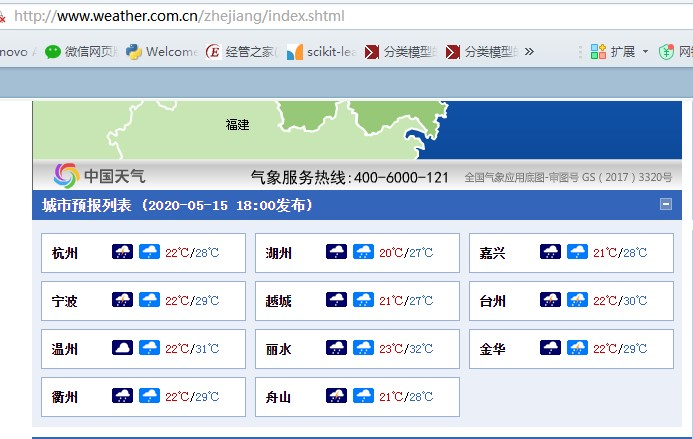
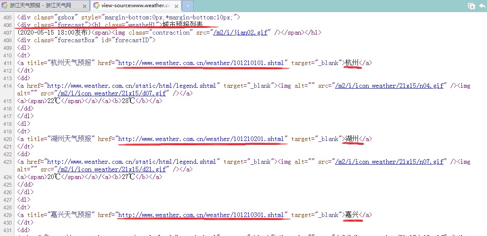
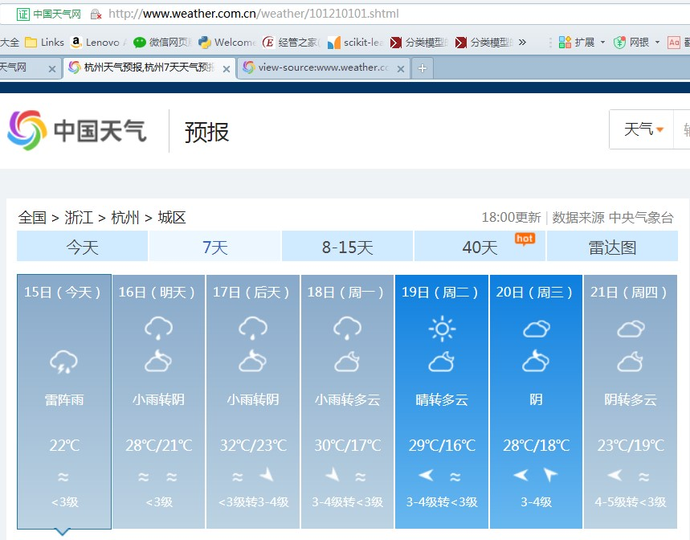
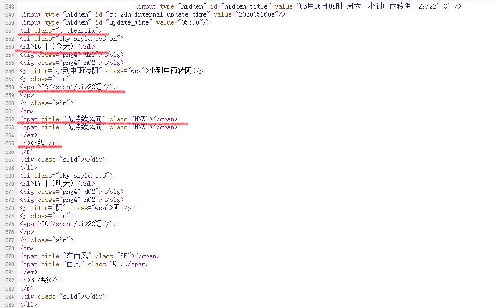

# Python使用scrapy框架爬取浙江各城市天气预报操作说明
安 装 Python 扩 展 库 scrapy ， 然 后 编 写 爬 虫 项 目 ， 从 网 站
http://www.weather.com.cn/zhejiang/index.shtml爬取浙江各城市的天气预报数据，并把爬取到的天气数据写入本地文本 weather.txt。
1. 在命令提示符环境(安装Python的Scripts目录下)使用 pip install scrapy 命令安装 Python 扩展库 scrapy。
2. 在命令提示符环境进入希望建立爬虫项目的文件夹中，使用 scrapy startproject zjWeatherSpider创建爬虫项目。
3. 进入爬虫项目文件夹， 然后执行命令`scrapy genspider everyCityinZJ www.weather.com.cn`创建爬虫程序。
4. 使用浏览器打开网址 `http://www.weather.com.cn/zhejiang/index.shtml`，找到下面位置。
5. 在页面上单击鼠标右键， 选择“查看网页源代码” ， 然后找到与“城市预报列表”对应的位置。
6. 选择并打开浙江省内任意城市的天气预报页面，此处以杭州为例。
7. 在页面上单击鼠标右键， 选择“查看网页源代码”，找到与上图中天气预报相对应的位置。
8. 修改 items.py文件， 定义要爬取的内容。
```python
import scrapy

class ZjweatherspiderItem(scrapy.Item):
# define the fields for your item here like:
# name = scrapy.Field()
city = scrapy.Field()
weather = scrapy.Field()

```
9. 修改爬虫文件 everyCityinZJ.py，定义如何爬取内容， 其中用到的规则参考前面对页面的分析，如果无法正常运行， 有可能是网页结构有变化，可以回到前面的步骤重新分析网页源代码。
```python
from re import findall
from urllib.request import urlopen
import scrapy
from zjWeatherSpider.items import ZjweatherspiderItem
class EverycityinzjSpider(scrapy.Spider):
    name = 'everyCityinZJ'
    allowed_domains = ['www.weather.com.cn']
    start_urls = []
    # 遍历各城市， 获取要爬取的页面 URL
    url = r'http://www.weather.com.cn/zhejiang/index.shtml'
    with urlopen(url) as fp:
        contents = fp.read().decode()
    pattern = '<a title=".*?" href="(.+?)" target="_blank">(.+?)</a>'
    for url in findall(pattern, contents):
        start_urls.append(url[0])
        
    def parse(self, response):
        # 处理每个城市的天气预报页面数据
        item = ZjweatherspiderItem()
        city = response.xpath('//div[@class="crumbs fl"]//a[3]//text()').extract()[0]
        item['city'] = city
        # 每个页面只有一个城市的天气数据， 直接取[0]
        selector = response.xpath('//ul[@class="t clearfix"]')[0]
        # 存放天气数据
        weather = ''
        for li in selector.xpath('./li'):
            date = li.xpath('./h1//text()').extract()[0]
            cloud = li.xpath('./p[@title]//text()').extract()[0]
            high = li.xpath('./p[@class="tem"]//span//text()').extract()[0]
            low = li.xpath('./p[@class="tem"]//i//text()').extract()[0]
            wind = li.xpath('./p[@class="win"]//em//span[1]/@title').extract()[0]
            wind = wind + li.xpath('./p[@class="win"]//i//text()').extract()[0]
            weather = weather + date+':'+cloud+','+high+r'/'+low+','+wind+'\n'
        item['weather'] = weather
        return [item]

```
10. 修改 pipelines.py 文件， 把爬取到的数据写入文件 weather.txt。
```python
class ZjweatherspiderPipeline(object):
def process_item(self, item, spider):
    with open('weather.txt', 'a', encoding='utf8') as fp:
        fp.write(item['city']+'\n')
        fp.write(item['weather']+'\n\n')

```
11. 修改settings.py 文件，分派任务，指定处理数据的程序。
```python
BOT_NAME = 'zjWeatherSpider'
SPIDER_MODULES = ['zjWeatherSpider.spiders']
NEWSPIDER_MODULE = 'zjWeatherSpider.spiders'

ITEM_PIPELINES = {
    'zjWeatherSpider.pipelines.ZjweatherspiderPipeline':1,
}
```
12. 切换到命令提示符环境，执行`scrapy crawl everyCityinZJ`命令运行爬虫程序。